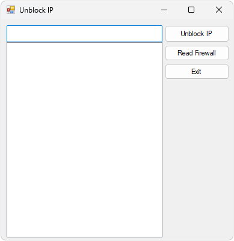

# UnblockIP for IPBan



This is a simple Windows Forms application designed to manage a list of IP addresses for unblocking. It allows users to unblock IPs from Firewall. This app I created for my father.

## Getting Started

### Prerequisites

- .NET Framework (version 4.7.2 or later)
- Visual Studio (2019 or later)

### Installing

1. Clone the repository:

    ```bash
    git clone https://github.com/alexander-yermolenko/unblockIP_forIPBan.git
    ```

2. Open the solution in Visual Studio.

3. Build the solution to ensure there are no errors.

4. Run the application.

## License

This project is licensed under the GNU Affero General Public License v3.0 - see the LICENSE file for details.